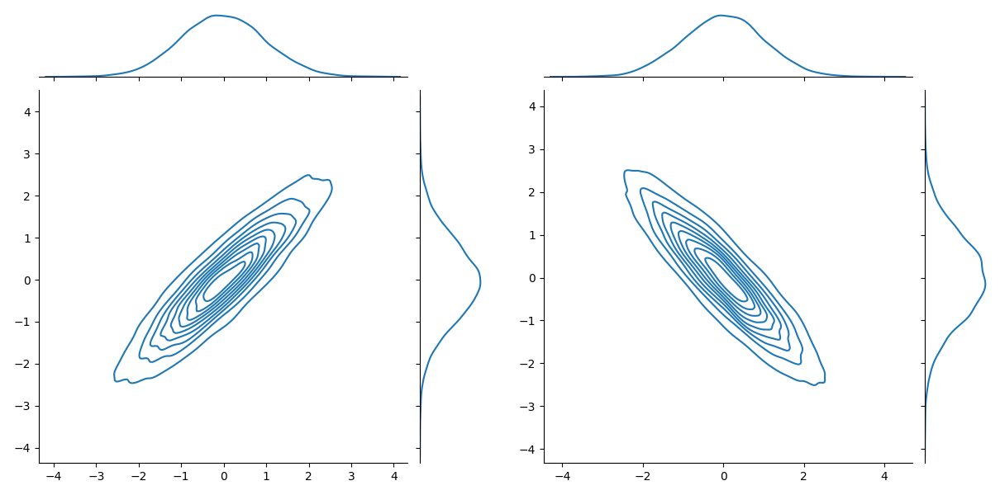

{align=right width="130"}

# Data drifting

---

!!! info "Core Module"

Data drifting is one of the core reasons for model accuracy degrades over time in production. For machine learning
models, data drift is the change in model input data that leads to model performance degradation. In practical terms,
this means that the model is receiving input that is outside the scope that it was trained on, as seen in the figure
below. This shows that the underlying distribution of a particular feature has slowly been increasing in value over
two years

<figure markdown>
{ width="700" }
<figcaption>
<a href="https://www.picsellia.com/post/what-is-data-drift-and-how-to-detect-it-with-mlops"> Image credit </a>
</figcaption>
</figure>

In some cases, it may be that if you normalize some feature in a better way that you are able to generalize your model
better, but this is not always the case. The reason for such a drift is commonly some external factor that you
essentially have no control over. That really only leaves you with one option: retrain your model on the newly received
input features and deploy that model to production. This process is probably going to repeat over the lifetime of your
application if you want to keep it up-to-date with the real world.

<figure markdown>
{ width="700" }
<figcaption>
<a href="https://www.evidentlyai.com/blog/machine-learning-monitoring-data-and-concept-drift"> Image credit </a>
</figcaption>
</figure>

We have now come up with a solution to the data drift problem, but there is one important detail that we have not taken
care of: When we should actually trigger the retraining? We do not want to wait around for our model performance to
degrade, thus we need tools that can detect when we are seeing a drift in our data.

## ❔ Exercises

For these exercises we are going to use the framework [Evidently](https://github.com/evidentlyai/evidently) developed by
[EvidentlyAI](https://www.evidentlyai.com). Evidently currently supports both detection for both regression and
classification models. The exercises are in large taken from
[here](https://docs.evidentlyai.com/get-started/hello-world) and in general we recommend if you are in doubt about an
exercise to look at the [docs](https://docs.evidentlyai.com/) for API and examples (their documentation can be a bit
lacking sometimes, so you may also have to dive into the source code).

Additionally, we want to stress that data drift detection, concept drift detection etc. is still an active field of
research and therefore exist multiple frameworks for doing this kind of detection. In addition to Evidently,
we can also mention [NannyML](https://github.com/NannyML/nannyml), [WhyLogs](https://github.com/whylabs/whylogs) and
[deepcheck](https://github.com/deepchecks/deepchecks).

1. Start by installing Evidently

    ```python
    pip install evidently
    ```

    You will also need `scikit-learn` and `pandas` installed if you do not already have it.

2. Hopefully you have already gone through session [S7 on deployment](../s7_deployment/README.md). As part of the
    deployment exercises about GCP functions you should have developed an application that can classify the
    [iris dataset](https://archive.ics.uci.edu/ml/datasets/iris). Your solution should look something like the script
    below:

    ??? example "Example GCP function for iris classification"

        ```python linenums="1" title="sklearn_train_function.py"
        --8<-- "s7_deployment/exercise_files/sklearn_main_function.py"
        ```

    Start by converting your GCP function into a FastAPI application. The appropriate `curl` command should look
    something like this:

    ```bash
    curl -X 'POST' \
        'http://127.0.0.1:8000/iris_v1/?sepal_length=1.0&sepal_width=1.0&petal_length=1.0&petal_width=1.0' \
        -H 'accept: application/json' \
        -d ''
    ```

    and the response body should look like this:

    ```json
    { "prediction": "Iris-Setosa", "prediction_int": 0 }
    ```

    ??? success "Solution"

        ```python linenums="1" title="iris_fastapi_solution.py"
        --8<-- "s8_monitoring/exercise_files/iris_fastapi_solution.py"
        ```

    1. Next we are going to add some functionality to our application. We need to add that the input for the user is
        saved to a database whenever our application is called. However, to not slow down the response to our user we
        want to implement this as a *background task*. A background task is a function that should be executed after
        the user have got their response. Implement a background task that save the user input to a database implemented
        as a simple `.csv` file. You can read more about background tasks
        [here](https://fastapi.tiangolo.com/tutorial/background-tasks/). The header of the database should look
        something like this:

        ```csv
        time, sepal_length, sepal_width, petal_length, petal_width, prediction
        2022-12-28 17:24:34.045649, 1.0, 1.0, 1.0, 1.0, 1
        2022-12-28 17:24:44.026432, 2.0, 2.0, 2.0, 2.0, 1
        ...
        ```

        Thus both input, timestamp and predicted value should be saved.

        ??? success "Solution"

            ```python linenums="1" title="iris_fastapi_solution.py"
            --8<-- "s8_monitoring/exercise_files/iris_fastapi_solution_2.py"
            ```

    2. Call you API a number of times to generate some dummy data in the database.

3. Create a new `data_drift.py` file where we are going to implement the data drifting detection and reporting. Start
    by adding both the real iris data and your generated dummy data as pandas data frames.

    ```python
    import pandas as pd
    from sklearn import datasets
    reference_data = datasets.load_iris(as_frame=True).frame
    current_data = pd.read_csv('prediction_database.csv')
    ```

    If done correctly you will most likely end up with two data frames that look like

    ```txt
    # reference_data
    sepal length (cm)  sepal width (cm)  petal length (cm)  petal width (cm)  target
    0                  5.1               3.5                1.4               0.2       0
    1                  4.9               3.0                1.4               0.2       0
    ...
    148                6.2               3.4                5.4               2.3       2
    149                5.9               3.0                5.1               1.8       2
    [150 rows x 5 columns]

    # current_data
    time                         sepal_length   sepal_width   petal_length   petal_width   prediction
    2022-12-28 17:24:34.045649   1.0            1.0            1.0           1.0           1
    ...
    2022-12-28 17:24:34.045649   1.0            1.0            1.0           1.0           1
    [10 rows x 5 columns]
    ```

    Standardize the data frames such that they have the same column names and drop the time column from the
    `current_data` data frame.

    ??? success "Solution"

        ```python
        import pandas as pd
        from sklearn import datasets
        reference_data = datasets.load_iris(as_frame=True).frame
        reference_data = reference_data.rename(
            columns={
                'sepal length (cm)': 'sepal_length',
                'sepal width (cm)': 'sepal_width',
                'petal length (cm)': 'petal_length',
                'petal width (cm)': 'petal_width',
                'target': 'target'
            }
        )

        current_data = pd.read_csv('prediction_database.csv')
        current_data = current_data.drop(columns=['time'])
        ```

    1. Add the following code to the `data_drift.py` file to create a report on the data drift:

        ```python
        from evidently.report import Report
        from evidently.metric_preset import DataDriftPreset
        report = Report(metrics=[DataDriftPreset()])
        report.run(reference_data=reference_data, current_data=current_data)
        report.save_html('report.html')
        ```

        Open the generated `.html` page. What does it say about your data? Have it drifted? Make sure to poke
        around to understand what the different plots are actually showing.

    2. Data drifting is not the only kind of reporting evidently can make. We can also get reports on the data quality.
        Look through the documentation of evidently and add the preset that has to do with data quality to the report.
        Try adding a few `Nan` values to your `current_data` and re-run the report. Checkout the report and go over the
        generated plots and make sure that it picked up on the missing values you just added.

        ??? success "Solution"

            The `DataQualityPreset` checks the quality of the data:

            ```python
            from evidently.metric_preset import DataDriftPreset, DataQualityPreset
            report = Report(metrics=[DataDriftPreset(), DataQualityPreset()])
            ```

    3. Another important kind of drift is called *target drift*, where the distribution of the target values have
        changed. If your training data was balanced, and you are now seeing a lot of one class being predicted this may
        indicate that your model is not performing as expected or that external factors have changed, which means that
        you should retrain your model. Find the preset that checks for target drift, add it to the report and re-run
        the analysis.

        ??? success "Solution"

            The `TargetDriftPreset` checks the distribution of the target values:

            ```python
            from evidently.metric_preset import DataDriftPreset, DataQualityPreset, TargetDriftPreset
            report = Report(metrics=[DataDriftPreset(), DataQualityPreset(), TargetDriftPreset()])
            ```

4. Evidently reports are meant for debugging, exploration and reporting of results. However, if we want to integrate
    evidently functionality into our already developed pipelines, either as a simple script, as part of a GitHub action
    workflow or something else, we need to be able to extract the results in a more programmatic way. This can be done
    using their `Test` and `TestSuites` classes. Implement a simple test that checks if there are any missing values in
    our dataset and print the results to the console.

    ??? success "Solution"

        Using the `.as_dict()` method on a `TestSuite` we can programmatically extract the results of the test. In
        particular the returned dictionary contains a key `summary` that contains a key `all_passed` that is `True` if
        all tests passed and `False` otherwise.

        ```python
        from evidently.test_suite import TestSuite
        from evidently.tests import TestNumberOfMissingValues
        data_test = TestSuite(tests=[TestNumberOfMissingValues()])
        data_test.run(reference_data=reference_data, current_data=current_data)
        result = data_test.as_dict()
        print(result)
        print("All tests passed: ", result['summary']['all_passed'])
        ```

    1. Take a look at this [colab notebook](https://colab.research.google.com/drive/1p9bgJZDcr_NS5IKVNvlxzswn6er9-abl)
        that contains all tests implemented in Evidently. Pick 5 tests of your choice, where at least 1 fails by default
        and implement them as a `TestSuite`. Then try changing the arguments of the test so they better fit your
        use case and get them all passing.

5. (Optional) When doing monitoring in practice, we are not always interested in running on all data collected from our
    API maybe only the last `N` entries or maybe just from the last hour of observations. Since we are already logging
    the timestamps of when our API is called we can use that for filtering. Implement a simple filter that

    * Takes an integer `n` and returns the last `n` entries in our database
    * Takes an integer `t` that filters away observations older than `t` hours

    ??? success "Solution"

        ```python
        import pandas as pd
        def filter_data(data: pd.Dataframe, n: int | None = None, t: int | None = None) -> pd.Dataframe:
            if n is not None:
                return data.tail(n)
            if t is not None:
                df['time'] = pd.to_datetime(df['time'])  # Ensure the 'time' column is a datetime object
                one_hour_ago = datetime.now() - timedelta(hours=t)
                return df[df['time'] > one_hour_ago]
            return data
        ```

6. Evidently by default only supports structured data e.g. tabular data (so does nearly every other framework). Thus,
    the question then becomes how we can extend unstructured data such as images or text? The solution is to extract
    structured features from the data which we then can run the analysis on.

    1. For images the simple solution would be to flatten the images and consider each pixel a feature,
        however this does not work in practice because changes in the individual pixels does not really tell anything
        about the image. Instead, we should derive some feature such as:

        * Average brightness
        * Contrast of an image
        * Image sharpness
        * ...

        These are all numbers that can make up a feature vector for a given image. Try out doing this yourself, for
        example by extracting such features from MNIST and FashionMNIST datasets, and check if you can detect a drift
        between the two sets.

        ??? success "Solution"

            ```python linenums="1" title="image_drift.py"
            --8<-- "s8_monitoring/exercise_files/image_drift.py"
            ```

    2. (Optional) For text a common approach is to extra some higher level embedding such as the very classical
        [GLOVE](https://nlp.stanford.edu/projects/glove/) embedding. Try following
        [this tutorial](https://github.com/evidentlyai/community-examples/blob/main/examples/how_to_run_drift_report_for_text_data.ipynb)
        to understand how drift detection is done on text.

    3. Instead of manually specifying the features, let's take a deep learning based approach to getting features from
        unstructured data. To do this let's consider the [CLIP](https://arxiv.org/abs/2103.00020) model, which is
        state-of-the-art model for connecting text to images e.g. image captioning. For our purpose this is perfect
        because we can use the model to get abstract feature embeddings for both images and text. Implement a simple
        script that extracts features from an image and a text using CLIP. We recommend using the
        [Huggingface implementation](https://huggingface.co/docs/transformers/model_doc/clip) for doing this. What is
        the size of the feature vector?

        ??? success "Solution"

            Both `img_features` and `text_features` for the standard CLIP model are a `(512,)` abstract feature
            embedding. We cannot interpret these features directly, but they should be able to tell us something about
            our data distribution.

            ```python linenums="1" title="clip_features.py"
            --8<-- "s8_monitoring/exercise_files/clip_features.py"
            ```

    4. Run your CLIP script on two different datasets for example
        [CIFAR10](https://pytorch.org/vision/main/generated/torchvision.datasets.CIFAR10.html) and
        [SVHN](https://pytorch.org/vision/main/generated/torchvision.datasets.SVHN.html#torchvision.datasets.SVHN)
        for images or
        [IMDB movie review](https://www.kaggle.com/code/lakshmi25npathi/sentiment-analysis-of-imdb-movie-reviews) and
        [Amazon review](https://www.kaggle.com/datasets/PromptCloudHQ/amazon-echo-dot-2-reviews-dataset) for text.
        Then run the data drift detection on the extracted features. What do you see? Does the data drift?

7. (Optional) If we have multiple applications and want to run monitoring for each application we often want also the
    monitoring to be a deployed application (that only we can access). Implement a `/monitoring` endpoint that does
    all the reporting we just went through such that you have two endpoints:

    ```bash
    http://127.0.0.1:8000/predict/?sepal_length=1.0&sepal_width=1.0&petal_length=1.0&petal_width=1.0  # user endpoint
    http://127.0.0.1:8000/monitoring/  # monitoring endpoint
    ```

    Our monitoring endpoint should return an HTML page either showing an Evidently report or test suit. Try implementing
    this endpoint.

    ??? success "Solution"

        ```python linenums="1" title="iris_fastapi_solution.py"
        --8<-- "s8_monitoring/exercise_files/iris_fastapi_solution_3.py"
        ```

## Data drift in the Cloud

In the next section we are going to look at how we can incorporate the data drifting in our cloud environment. In
particular, we are going to be looking at how we can deploy a monitoring application that will run on a schedule and
then report those statistics directly back into GCP for us to study.

### ❔ Exercises

In this set of exercises we are going to deploy a machine learning model for sentiment analysis trained on
[Google Play Store Reviews](https://www.kaggle.com/datasets/prakharrathi25/google-play-store-reviews). The models task
is to predict if a users review is positive, neutral or negative in sentiment. We are then going to deploy a monitoring
service that will check if the distribution of the reviews have drifted over time. This may be useful if we are seeing
a decrease in the number of positive reviews over time, which may indicate that our application is not performing as
expected.

We have already created downloaded the training data, created a training script and trained a model for you.
The training data and the trained model is available to download from the following
[Google Drive folder](https://drive.google.com/drive/folders/19rZSGk4A4O7kDqPQiomgV0TiZkRpZ1Rs?usp=sharing) which can
be quickly downloaded by running the following commands (which uses the [gdown](https://github.com/wkentaro/gdown)
Python package):

```bash
pip install gdown
gdown --folder https://drive.google.com/drive/folders/19rZSGk4A4O7kDqPQiomgV0TiZkRpZ1Rs?usp=sharing
```

And the training script can be seen below. You are free to retrain the model yourself, but it takes about 30 mins to
train using a GPU. Overall the model scores around 74% accuracy on a hold-out test set. We recommend that you scroll
through the files to get an understanding of what is going on.

??? example "Training script for sentiment analysis model"

    ```python linenums="1" title="sentiment_classifier.py"
    --8<-- "s8_monitoring/exercise_files/sentiment_classifier.py"
    ```

1. To begin with lets start by uploading the training data and model to a GCP bucket. Upload to a new GCP bucket
    called `gcp_monitoring_exercise` (or something similar). Upload the training data and the trained model to the
    bucket.

    ??? success "Solution"

        This can be done by running the following commands or manually uploading the files to the bucket using the
        GCP console.

        ```
        gsutil mb gs://gcp_monitoring_exercise
        gsutil cp reviews.csv gs://gcp_monitoring_exercise/reviews.csv
        gsutil cp bert_sentiment_model.pt gs://gcp_monitoring_exercise/bert_sentiment_model.pt
        ```

2. Next we need to create a FastAPI application that takes a review as input and returns the predicted sentiment of
    the review. We provide a starting point for the application in the file below, that should be able to run as is.

    ??? example "Starting point for sentiment analysis API"

        ```python linenums="1" title="sentiment_api_starter.py"
        --8<-- "s8_monitoring/exercise_files/sentiment_api_starter.py"
        ```

    1. Confirm that you can run the application by running the following command in the terminal

        ```bash
        uvicorn sentiment_api_starter:app --reload
        ```

        You need the model file saved in the same directory as the application to run the application. Write a small
        `client.py` script that calls the application with a review and prints the predicted sentiment.

        ??? success "Solution"

            ```python
            import requests

            url = "http://localhost:8000/predict"
            review = "This is a great app, I love it!"
            response = requests.post(url, json={"review": review})
            print(response.json())
            ```

    2. Next, we need to extend the application in two ways. First instead of loading the model from our local computer,
        it should load from the bucket we just uploaded the model to. Secondly, we need to save the request data and the
        predicted label to the cloud. Normally this would best be suited in a database, but we are going to just save
        to the same bucket as the model. We just need to make sure each request is saved under a unique name (e.g. the
        time and date of the request). Implement both of these functionalities in the application. To interact with
        GCP buckets in Python you should install the `google-cloud-storage` package if you have not already done so.

        ```bash
        pip install google-cloud-storage
        ```

        ??? success "Solution"

            ```python linenums="1" title="sentiment_api.py"
            --8<-- "s8_monitoring/exercise_files/sentiment_api.py"
            ```

    3. You should confirm that the application is working locally before moving on. You can do this by running the
        following command in the terminal

        ```bash
        uvicorn sentiment_api:app --reload
        ```

        And use the same `client.py` script as before to confirm that the application is working. You should also check
        that the data is saved to the bucket.

    4. Write a small Dockerfile that containerize the application

        ??? success "Solution"

            ```docker linenums="1" title="sentiment_api.dockerfilepy"
            --8<-- "s8_monitoring/exercise_files/sentiment_api.dockerfile"
            ```

            which can be built by running the following command

            ```bash
            docker build -f sentiment_api.dockerfile -t sentiment_api:latest .
            ```

    5. Deploy the container to cloud run and confirm that the application still runs as expected.

        ??? success "Solution"

            The following four commands should be able to deploy the application to GCP cloud run. Make sure to replace
            `<location>`, `<project-id>` and `<repo-name>` with the appropriate values.

            ```bash
            gcloud artifacts repositories create <repo-name> --repository-format=docker --location=<location>
            docker tag sentiment_api:latest <location>-docker.pkg.dev/<project-id>/<repo-name>/sentiment_api:latest
            docker push <location>-docker.pkg.dev/<project-id>/<repo-name>/sentiment_api:latest
            gcloud run deploy sentiment-api \
                --image <location>-docker.pkg.dev/<project-id>/<repo-name>/sentiment_api:latest \
                --region <region> --allow-unauthenticated
            ```

    6. Make sure that the application still works by trying to send a couple of requests to the deployed application and
        make sure that the request/response data is correctly saved to the bucket.

        ??? success "Solution"

            To get the url of the deployed service you can run the following command

            ```bash
            gcloud run services describe sentiment-api --format 'value(status.url)'
            ```

            which can the be used in the `client.py` script to call the deployed service.

3. We now have a working application that we are ready to monitor for data drift in real time. We therefore need to now
    write a FastAPI application that takes in the training data and the predicted data and run evidently to check if the
    data or the labels have drifted. Furthermore, we again provide a starting point for the application below.

    ```python linenums="1" title="sentiment_monitoring_starter.py"
    --8<-- "s8_monitoring/exercise_files/sentiment_monitoring_starter.py"
    ```

    Look over the script and make sure you know what kind of features we are going to monitor?

    ??? success "Solution"

        The provided starting script makes use of two presets from evidently:
        [TextOverviewPreset](https://docs.evidentlyai.com/presets/text-overview) and
        [TargetDriftPreset](https://docs.evidentlyai.com/presets/target-drift). The first preset extracts descriptive
        text statistics (like number of words, average word length etc.) and runs data drift detection on these and the
        second preset runs target drift detection on the predicted labels.

    1. The script misses one key function to work: `#!python fetch_latest_data(n: int)` that should fetch the latest `n`
        predictions. Implement this function in the script.

        ??? success "Solution"

            ```python linenums="1" title="sentiment_monitoring.py"
            --8<-- "s8_monitoring/exercise_files/sentiment_monitoring.py"
            ```

    2. Test out the script locally. This can be done by downloading a couple of the request/response data from the
        bucket and running the script on this data.

    3. Write a Dockerfile that containerize the monitoring application

        ??? success "Solution"

            ```docker linenums="1" title="sentiment_monitoring.dockerfile"
            --8<-- "s8_monitoring/exercise_files/sentiment_monitoring.dockerfile"
            ```

That ends the module on detection of data drifting, data quality etc. If this has not already been made clear,
monitoring of machine learning applications is an extremely hard discipline because it is not a clear cut when we
should actually respond to feature beginning to drift and when it is probably fine. That comes down to the individual
application what kind of rules that should be implemented. Additionally, the tools presented here are also in no way
complete and are especially limited in one way: they are only considering the marginal distribution of data. Every
analysis that we done have been on the distribution per feature (the marginal distribution), however as the image below
show it is possible for data to have drifted to another distribution with the marginal being approximately the same.

<figure markdown>
{width="500"}
</figure>

There are methods such as [Maximum Mean Discrepancy (MMD) tests](https://jmlr.org/papers/v13/gretton12a.html) that are
able to do testing on multivariate distributions, which you are free to dive into. In this course we will just always
recommend to consider multiple features when doing decision regarding your deployed applications.
