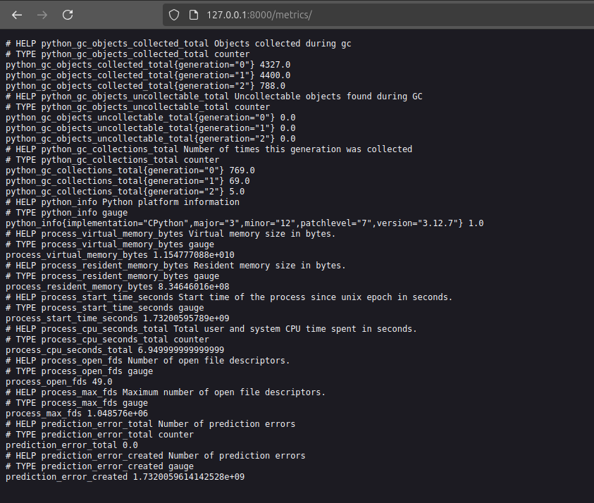
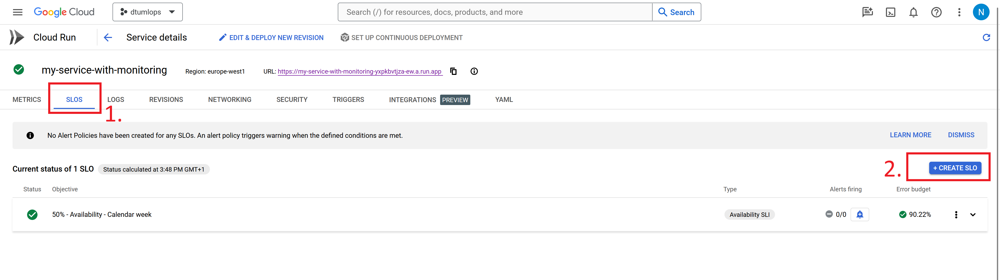

{ align=right width="130"}
{ align=right width="130"}

# Telemetry and monitoring

---

As machine learning models are increasing embedded into applications and real-time systems, ensuring that these models
operate as expected is becoming increasingly important. If our systems are real-time, we therefore also need monitoring
systems that are real-time. For this reason, we need to learn about setting up system that can expose *telemetry data*
in real-time. Telemetry data is in general refers to any automatic measurement and wireless transmission of data from
our application. It could be information such as:

* The number of requests our application receiving per minute/hour/day. This number is of interest because it is
    directly proportional to the ru[text](exercise_files/sentiment_api_prometheus_1.py)nning cost of application.
* The amount of time (on average) our application runs per request. The number is of interest because it most likely is
    the core contributor to the latency that our users are experience (which we want to be low).
* The amount of errors our application is encountering. This number is of interest because it is directly proportional
    to the amount of time we need to spend debugging and fixing the application.
* ...

and so much more. The point is that we need to be able to measure these things in real-time, and we need to be able to
react to them in real-time. In general there are three different kinds of telemetry we are interested in: Metrics, Logs
and Traces which we are going to learn about in this module.

<figure markdown>
{ width="1000" }
<figcaption>
The observability stack we are going to setup in this module. We are going to be using
<a href="https://prometheus.io/"> Prometheus</a> for metrics,
<a href="https://grafana.com/oss/loki/"> Loki</a> for logs and
<a href="https://grafana.com/oss/tempo/"> Tempo</a> for traces. In the end we are going to be using
<a href="hhttps://grafana.com/oss/grafana/"> Grafana</a> to visualize the data.
<a href="https://github.com/blueswen/fastapi-observability"> Image credit </a> </figcaption>
</figure>

## Metrics logging

The first kind of telemetry that most want to implement into their applications are metrics. Metrics provide quick,
lightweight insights into the overall health and performance of a system. Metrics are in general quantitative
measurements of the system and are usually numbers that are aggregated over time. As an example, the number of requests
per minute is a metric that is often used to measure the performance of an application. Metrics in general

There are multiple tools for setting up metrics logging, but the most common one is
[Prometheus](https://prometheus.io/). Prometheus is an open-source monitoring and alerting toolkit that is designed to
be very easy to instrument applications with. It is designed to store metrics in a time series database and to be able
to query those metrics in real-time. The way Prometheus works is that it exposes a `/metrics` endpoint that can be
queried to get the current state of the metrics. The metrics are exposed in a format called
[Prometheus text format](https://prometheus.io/docs/instrumenting/exposition_formats/). After having exposed the
metrics, we are then able to create dashboards that can be used to get an overview of the system. For this we are going
to use [Grafana](https://grafana.com/), which is an open-source platform for creating dashboards and analyzing
time-series data.

### ❔ Exercises

1. Start by installing the Prometheus python client

    ```bash
    pip install prometheus-client
    ```

    Remember to add the package to your `requirements.txt` file.

2. Before getting started on the coding part, we first need to understand the different kind of metrics that Prometheus
    allows for us to specify. Look through the [documentation](https://prometheus.io/docs/concepts/metric_types/) and
    describe the different types of metrics that Prometheus allows for.

    ??? success "Solution"

        The different types of metrics that prometheus allows for are:

        * `Counter`: A counter is a cumulative metric that represents a single monotonically increasing counter whose
            value can only increase or be reset to zero on restart.
        * `Gauge`: A gauge is a metric that represents a single numerical value that can arbitrarily go up and down.
            This is typically used for measured values like current memory usage, CPU usage, etc.
        * `Histogram`: A histogram samples observations (usually things like request durations or response sizes) and
            counts them in configurable buckets. It also provides a sum of all observed values.
        * `Summary`: Similar to a histogram, a summary samples observations (usually things like request durations and
            response sizes). While it also provides a total count of observations and a sum of all observed values, it
            calculates configurable quantiles over a sliding time window.

3. Assuming you have done the [previous module on data drifting](data_drifting.md) you should be familiar with the
    following API that uses a Bert model to classify the sentiment of a given review. The purpose of this exercise is
    to add some meaningful metrics to that API.

    ??? example "Sentiment API"

        ```python linenums="1" title="sentiment_api.py"
        --8<-- "s8_monitoring/exercise_files/sentiment_api.py"
        ```

    To begin with you need to do the following: Add a single metric of the type `Counter` that counts the number of
    errors the API has encountered. Then, secondly add a `app.mount` that exposes the metrics on the `/metrics`
    endpoint. When you have done this you should be able to see the metrics by running the application and going to the
    `/metrics` endpoint. You can look at the [documentation](https://prometheus.github.io/client_python/) for help on
    how to do this.

    ??? success "Solution"

        The important parts that implements the prometheus metrics are highlighted below:

        ```python linenums="1" hl_lines="10 50 74 135"
        --8<-- "s8_monitoring/exercise_files/sentiment_api_prometheus_simple.py"
        ```

    1. If you have done the previous exercise correctly you should be seeing something like the image below

        <figure markdown>
        { width="800" }
        </figure>

        Figure out why there are many more metrics than the single one you added and try to make the metric you defined
        increase in value by sending error requests to the API.

        ??? success "Solution"

            All metrics in prometheus belongs to a `registry`. The
            [registry](https://github.com/prometheus/client_python/blob/master/prometheus_client/registry.py) is a
            collection of metrics. If you do not specify a registry when you create a metric like this

            ```python
            MY_REGISTRY = CollectorRegistry()
            my_counter = Counter('my_counter', 'This is my counter', registry=MY_REGISTRY)
            ```

            then the metric will be added to the default registry. The default registry already contains a lot of
            metrics that are added by the `prometheus-client` package. To only see the metrics that you have added you
            need to specify your own registry like above and only expose that registry on the `/metrics` endpoint.

            ```python
            app.mount("/metrics", make_asgi_app(registry=MY_REGISTRY))
            ```

            For the second part of the question you can increase the value of the counter by sending a request to the
            API that will raise an error. In this case the API will raise an 500 error if the review is too long. After
            this you should see the counter increase in value.

    2. Next, we ask you to add a few more metrics to the API. Specifically we ask you to add the following metrics:

        * Add a `Counter` metric that counts the number of requests the API has received.
        * Add a `Histogram` metric that measures the time it takes to classify a review.
        * Add a `Summary` metric that measures the size of the reviews that are classified.

        Confirm that everything works by running the application, sending a couple of requests to the API and then
        checking the `/metrics` endpoint updates as expected.

        ??? success "Solution"

            The important parts that implements the prometheus metrics are highlighted below:

            ```python linenums="1" hl_lines="10 50-53 76 110 111 113 141"
            --8<-- "s8_monitoring/exercise_files/sentiment_api_prometheus_advance.py"
            ```

    3. Write a small dockerfile that containerizes the application. Check that you can build the container and run it.

        ??? example "Dockerfile for sentiment API"

            We here assume that you have implemented the code in a file called `sentiment_api_prometheus_advance.py`

            ```dockerfile
            --8<-- "s8_monitoring/exercise_files/sentiment_api_prometheus.dockerfile"
            ```

4. We are now going to containerize this setup, but there are a new complexity that we have not encountered before in
    our containerization. We need to set up a sidecar container that is going to collect the metrics from the main
    container. To do this we are going to use [Docker compose](https://docs.docker.com/compose/). Docker compose is a
    tool for defining and running multi-container Docker applications. With Compose, you use a YAML file to configure
    your application's services. Then, with a single command, you create and start all the services from your
    configuration. To get started with Docker compose you need to create a `docker-compose.yaml` file that specifies the
    two containers. The first container is the application container and the second container is the sidecar container.
    Look at the [documentation](https://docs.docker.com/compose/gettingstarted/) for help on how to do this.

    ??? success "Solution"

        The following docker compose file specifies the two containers. The first container is the application container
        and the second container is the sidecar prometheus container.

        ```yaml
        --8<-- "s8_monitoring/exercise_files/docker-compose.yaml"
        ```

        As a note for the sidecar container we mount a special `prometheus.yaml` file that
        can be used to configure the scraping interval of the prometheus server. The default scraping interval is 1 min
        but if you want to change it you could add the following to the `prometheus.yaml` file:

        ```yaml title="prometheus.yaml"
        --8<-- "s8_monitoring/exercise_files/prometheus.yaml"
        ```

    1. Build the application and the sidecar container by running the following command:

        ```bash
        docker compose build
        ```

    2. Run the application and the sidecar container by running the following command:

        ```bash
        docker compose up
        ```

    3. Confirm that the application is running by going to the `/metrics` endpoint. Confirm that the sidecar container
        is collecting the metrics by going to the `/metrics` endpoint of the sidecar container.

## Logs logging

The second kind of telemetry that we are interested in is logs. Logs are textual or structured records generated by
applications. They provide a detailed account of events, errors, warnings, and informational messages that occur during
the operation of the system. Logs are essential for diagnosing issues, debugging, and auditing. They provide a detailed
history of what happened in a system, making it easier to trace the root cause of problems and track the behavior of
components over time. You should hopefully already be familiar with the `logging` module in Python assuming you have
completed this [previous module on logging](../s4_debugging_and_logging/logging.md).

There are multiple tools for setting up logs logging/log gathering, but since we are already using the prometheus/grafana
stack we are going to use [Loki](https://grafana.com/oss/loki/) which is a horizontally-scalable, highly-available,
multi-tenant log aggregation system inspired by Prometheus. It is designed to be very easy to use and to be able to
handle large amounts of log data.

### ❔ Exercises

## Traces logging

Trace logging is the third kind of telemetry that we are interested in. Traces are detailed records of specific
transactions or events as they move through a system. A trace typically includes information about the sequence of
operations, timing, and dependencies between different components. Traces are valuable for identifying bottlenecks,
understanding latency, and troubleshooting issues related to the flow of data or control. Traces are especially useful
for understanding the flow of a request or a transaction across different components in a distributed system.

## Local instrumentator

Before we look into the cloud lets at least conceptually understand how a given instance of a app can expose values that
we may be interested in monitoring.

The standard framework for exposing metrics is called [prometheus](https://prometheus.io/). Prometheus is a time series
database that is designed to store metrics. It is also designed to be very easy to instrument applications with and it
is designed to scale to large amounts of data. The way prometheus works is that it exposes a `/metrics` endpoint that
can be queried to get the current state of the metrics. The metrics are exposed in a format called [prometheus text
format](https://prometheus.io/docs/instrumenting/exposition_formats/).

### ❔ Exercises

1. Start by installing `prometheus-fastapi-instrumentator` in python

    ```bash
    pip install prometheus-fastapi-instrumentator
    ```

    this will allow us to easily instrument our FastAPI application with prometheus.

2. Create a simple FastAPI application in a file called `app.py`. You can reuse any application from the previous
    [module on APIs](../s7_deployment/apis.md). To that file now add the following code:

    ```python
    from prometheus_fastapi_instrumentator import Instrumentator

    # your app code here

    Instrumentator().instrument(app).expose(app)
    ```

    This will instrument your application with prometheus and expose the metrics on the `/metrics` endpoint.

3. Run the app using `uvicorn` server. Make sure that the app exposes the endpoints you expect it too exposes, but make
    sure you also checkout the `/metrics` endpoint.

4. The metric endpoint exposes multiple `/metrics`. Metrics always looks like this:

    ```txt
    # TYPE key <type>
    key value
    ```

    e.g. it is essentially a ditionary of key-value pairs with the added functionality of a `<type>`. Look at this
    [page](https://prometheus.io/docs/concepts/metric_types/) over the different types prometheus metrics can have and
    try to understand the different metrics being exposed.

5. Look at the [documentation](https://prometheus.io/docs/instrumenting/exposition_formats/) for the
    `prometheus-fastapi-instrumentator` and try to add at least one more metric to your application. Rerun the
    application and confirm that the new metric is being exposed.

## Cloud monitoring

Any cloud system with respect for itself will have some kind of monitoring system. GCP has a
service called [Monitoring](https://cloud.google.com/monitoring) that is designed to monitor all the different services.
By default it will monitor a lot of metrics out-of-box. However, the question is if we want to monitor more than the
default metrics. The complexity that comes with doing monitoring in the cloud is that we need more than one container.
We at least need one container actually running the application that is also exposing the `/metrics` endpoint and then
we need a another container that is collecting the metrics from the first container and storing them in a database. To
implement such system of containers that need to talk to each others we in general need to use a container orchestration
system such as [Kubernetes](https://kubernetes.io/). This is out of scope for this course, but we can use a feature
of `Cloud Run` called `sidecar containers` to achieve the same effect. A sidecar container is a container that is
running alongside the main container and can be used to do things such as collecting metrics.

<figure markdown>
{ width="800" }
</figure>

### ❔ Exercises

1. Overall we recommend that you just become familiar with the monitoring tab for your cloud run service (see image)
    above. Try to invoke your service a couple of times and see what happens to the metrics over time.

    1. (Optional) If you really want to load test your application we recommend checking out the tool
        [locust](https://locust.io/). Locust is a Python based load testing tool that can be used to simulate many
        users accessing your application at the same time.

2. Try creating a service level objective (SLO). In short a [SLO](https://sre.google/sre-book/service-level-objectives/)
    is a target for how well your application should be performing. Click the `Create SLO` button and fill it out with
    what you consider to be a good SLO for your application.

    <figure markdown>
    { width="800" }
    </figure>

3. (Optional) To expose our own metrics we need to setup a sidecar container. To do this follow the instructions
    [here](https://cloud.google.com/stackdriver/docs/managed-prometheus/cloudrun-sidecar#default-configuration). We have
    setup a simple example that uses fastapi and prometheus that you can find
    [here](https://github.com/SkafteNicki/gcp_monitoring_test). After you have correctly setup the sidecar container you
    should be able to see the metrics in the monitoring tab.

## Alert systems

A core problem within monitoring is alert systems. The alert system is in charge of sending out alerts to relevant
people when some telemetry or metric we are tracking is not behaving as it should. Alert systems are a subjective
choice of when and how many should be send out and in general should be proportional with how important to the of the
metric/telemetry. We commonly run into what is referred to the
[goldielock problem](https://en.wikipedia.org/wiki/Goldilocks_principle) where we want just the *right amount* of alerts
however it is more often the case that we either have

* Too many alerts, such that they become irrelevant and the really important ones are overseen, often referred to as
    alert fatigue
* Or alternatively, we have too little alerts and problems that should have triggered an alert is not dealt with when
    they happen which can have unforeseen consequences.

Therefore, setting up proper alert systems can be as challenging as setting up the systems for actually the metrics we
want to trigger alerts.

### ❔ Exercises

We are in this exercise going to look at how we can setup automatic alerting such that we get an message every time one
of our applications are not behaving as expected.

1. Go to the `Monitoring` service. Then go to `Alerting` tab.
    <figure markdown>
    { width="800" }
    </figure>

2. Start by setting up an notification channel. A recommend setting up with an email.

3. Next lets create a policy. Clicking the `Add Condition` should bring up a window as below. You are free to setup the
   condition as you want but the image is one way bo setup an alert that will react to the number of times an cloud
   function is invoked (actually it measures the amount of log entries from cloud functions).

    <figure markdown>
    { width="800" }
    </figure>

4. After adding the condition, add the notification channel you created in one of the earlier steps. Remember to also
    add some documentation that should be send with the alert to better describe what the alert is actually doing.

5. When the alert is setup you need to trigger it. If you setup the condition as the image above you just need to
    invoke the cloud function many times. Here is a small code snippet that you can execute on your laptop to call a
    cloud function many time (you need to change the url and payload depending on your function):

    ```python
    import time
    import requests
    url = 'https://us-central1-dtumlops-335110.cloudfunctions.net/function-2'
    payload = {'message': 'Hello, General Kenobi'}

    for _ in range(1000):
        r = requests.get(url, params=payload)
    ```

6. Make sure that you get the alert through the notification channel you setup.
