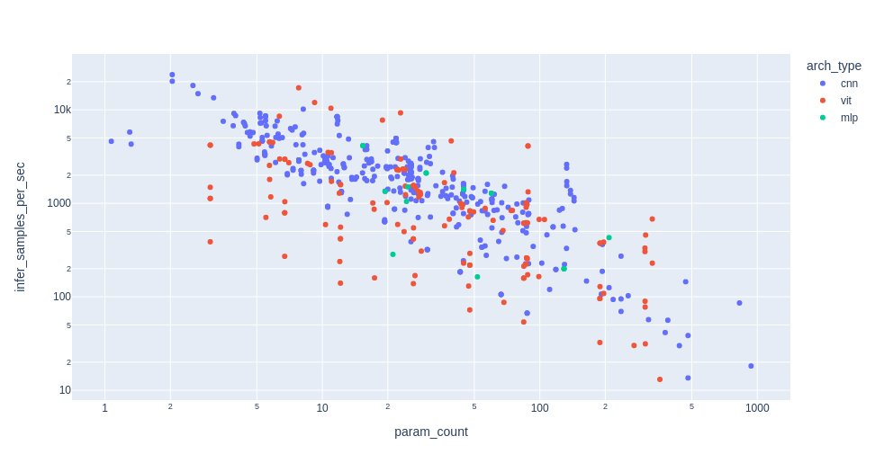
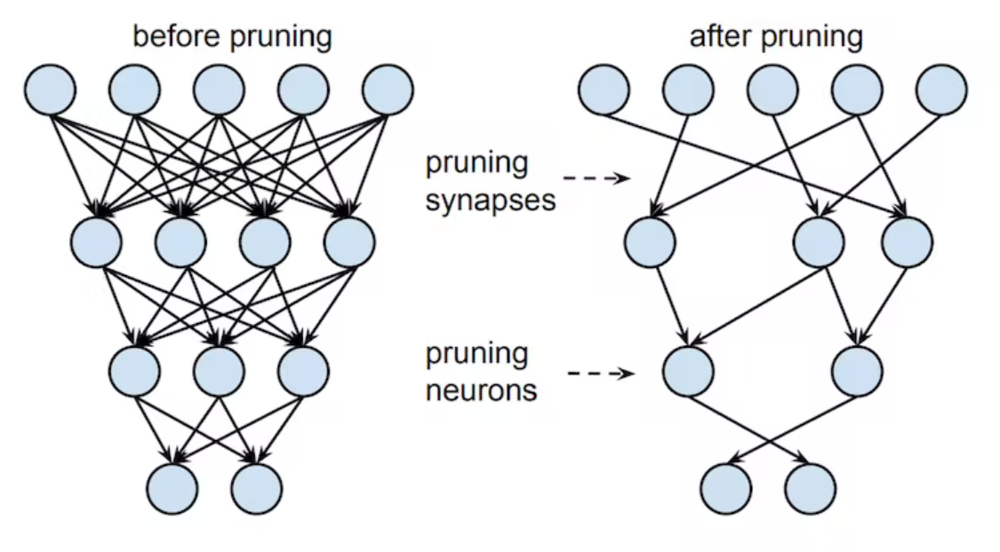
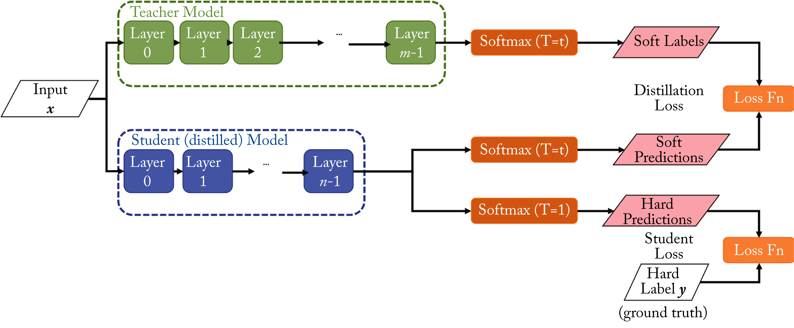

# Scalable Inference
{: .no_toc }

<details open markdown="block">
  <summary>
    Table of contents
  </summary>
  {: .text-delta }
1. TOC
{:toc}
</details>

---

Inference is task of applying our trained model to some new and unseen data, often called *prediction*. Thus, scaling
inference is different from scaling data loading and training, mainly due to inference normally only using a single
data point (or a few). As we can neither parallelize the data loading or parallelize using multiple GPUs (at least
not in any efficient way), this is of no use to us when we are doing inference. Secondly, inference is often not
something we do on machines that can perform large computations, as most inference today is actually either done on
*edge* devices e.g. mobile phones or in low-cost-low-compute cloud environments. Thus, we need to be smarter about how
we scale inference than just throwing more compute at it.

\
In this module we are going to look at various ways that you can either reduce the size of your model and or make your
model faster. Both are important for running inference fast regardless of the setup you are running your model on. We
want to note that this is still very much an active area of research and therefore best practices for what to do in a
specific situation can change.

## Choosing the right architecture

Assume you are starting a completely new project and have to come up with a model architecture for doing this. What is
you strategy? The common way to do this, is to look at prior work on similar problems that you are facing and either
directly choosing the same architecture or creating some slight variation hereof. This is a great way to get started,
but the architecture that you end up choosing may be optimal in terms of performance but not inference speed.

\
The fact is that not all base architectures are created equal, and a 10K parameter model with one architecture can have
significantly different inference speed than another 10K parameter model with another architecture. For example,
consider the figure below which compares a number of models from the [timm] package, colored based on their base
architecture. The general trend is that the number of images that can be processed by a model per sec (y-axis) is
inverse proportional to the number of parameters (x-axis). However, we in general see that convolutional base
architectures (conv) are more efficient than transformer (vit) for the same parameter budget.

<p align="center">
   
   <br>
   <a href="https://twitter.com/wightmanr/status/1453060491970953217"> Image credit </a>
</p>

### Exercises

As dissed in this
[blogpost](https://devblog.pytorchlightning.ai/training-an-edge-optimized-speech-recognition-model-with-pytorch-lightning-a0a6a0c2a413)
the largest increase in inference speed you will see (given some speficic hardware) is choosing an efficient model
architechture. In the exercises below we are going to investigate the inference speed of different architechtures.

1. Start by checking out this
   [table](https://pytorch.org/vision/stable/models.html#table-of-all-available-classification-weights)
   which contains a list of pretrained weights in `torchvision`. Try finding an

   * Efficientnet
   * Resnet
   * Transformer based

   model that have in the range of 20-30 mio parameters.

2. Write a small script that initialize all models and does inference with them. It should look something like this

   ```python
   import time
   from torchvision import models

   m1 = models.ModelArchitechture1()
   m2 = models.ModelArchitechture2()
   m3 = models.ModelArchitechture3()

   input = torch.randn(100, 3, 256, 256)

   for i, m in enumerate([m1, m2, m3]):
      tic = time.time()
      for _ in range(n_reps):
         _ = m(input)
      toc = time.time()
      print(f"Model {i} took: {(toc - tic) / n_reps}")
   ```

3. Does the results make sense? Based on the above figure we would expect that efficientnet is faster than resnet,
   which is faster than the transformer based model. Is this also what you are seeing?

4. To figure out why one net is more efficient than another we can try to count the operations each network need to
   do for inference. A operation here we can define as a
   [FLOP (floating point operation)](https://en.wikipedia.org/wiki/FLOPS) which is any mathematical operation (such as
   +, -, *, /) or assignment that involves floating-point numbers. Luckily for us someone has already created a python
   package for calculating this in pytorch: [ptflops](https://github.com/sovrasov/flops-counter.pytorch)

   1. Install the package

      ```bash
      pip install ptflops
      ```

   2. Try calling the `get_model_complexity_info` function from the `ptflops` package on the networks from the
      previous exercise. What are the results?

5. In the table from the initial exercise, you could also see the overall performance of each network on the
   Imagenet-1K dataset. Given this performance, the inference speed, the flops count what network would you choose
   to use in a production setting? Discuss when choosing one over another should be considered.

## Quantization

Quantization is a technique where all computations are performed with integers instead of floats.
We are essentially taking all continuous signals and converting them into discretized signals.

<p align="center">
   
</p>

As discussed in this
[blogpost series](https://devblog.pytorchlightning.ai/benchmarking-quantized-mobile-speech-recognition-models-with-pytorch-lightning-and-grid-9a69f7503d07),
while `float` (32-bit) is the primarily used precision in machine learning because is strikes a good balance between
memory consumption, precision and computational requirement it does not mean that during inference we can take
advantage of quantization to improve the speed of our model. For instance:

* Floating-point computations are slower than integer operations

* Recent hardware have specialized hardware for doing integer operations

* Many neural networks are actually not bottlenecked by how many computations they need to do but by how fast we can
  transfer data e.g. the memory bandwidth and cache of your system is the limiting factor. Therefore working with 8-bit
  integers vs 32-bit floats means that we can approximately move data around 4 times as fast.

* Storing models in integers instead of floats save us approximately 75% of the ram/harddisk space whenever we save
  a checkpoint. This is especially useful in relation to deploying models using docker (as you hopefully remember) as
  it will lower the size of our docker images.

But how do we convert between floats and integers in quantization? In most cases we often use a
*linear affine quantization*:

$$
x_{int} = \text{round}\left( \frac{x_{float}}{s} + z \right)
$$

where $s$ is a scale and $z$ is the so called zero point. But how does to doing inference in a neural network. The
figure below shows all the conversations that we need to make to our standard inference pipeline to actually do
computations in quantized format.

<!-- markdownlint-disable -->
<p align="center">
   
   <br>
   <a href="https://devblog.pytorchlightning.ai/how-to-train-edge-optimized-speech-recognition-models-with-pytorch-lightning-part-2-quantization-2eaa676b1512"> Image credit </a>
</p>
<!-- markdownlint-restore -->

### Exercises

1. Lets look at how quantized tensors look in Pytorch

   1. Start by creating a tensor that contains both random numbers

   2. Next call the `torch.quantize_per_tensor` function on the tensor. What does the quantized tensor
      look like? How does the values relate to the `scale` and `zero_point` arguments.

   3. Finally, try to call the `.dequantize()` method on the tensor. Do you get a tensor back that is
      close to what you initially started out with.

2. As you hopefully saw in the first exercise we are going to perform a number of rounding errors when
   doing quantization and naively we would expect that this would accumulate and lead to a much worse model.
   However, in practice we observe that quantization still works, and we actually have a mathematically
   sound reason for this. Can you figure out why quantization still works with all the small rounding
   errors? HINT: it has to do with the [central limit theorem](https://en.wikipedia.org/wiki/Central_limit_theorem)

3. Lets move on to quantization of our model. Follow this
   [tutorial](https://pytorch.org/docs/stable/quantization.html) from Pytorch on how to do quantization. The goal is
   to construct a model `model_fc32` that works on normal floats and a quantized version `model_int8`. For simplicity
   you can just use one of the models from the tutorial.

4. Lets try to benchmark our quantized model and see if all the trouble that we went through actually paid of. Also
   try to perform the benchmark on the non-quantized model and see if you get a difference. If you do not get an
   improvement, explain why that may be.

5. (Optional) The quantization we have look on until now is a post-processing step, taking a trained model and
   converting it. However, quantization can be further implemented into our pipeline by doing
   `quantization aware training`, where we also apply quantization during training to hopefully get model that quantize
   better in the end. This can easily be done in lightning using the
   [QuantizationAwareTraining](https://pytorch-lightning.readthedocs.io/en/latest/api/pytorch_lightning.callbacks.QuantizationAwareTraining.html#pytorch_lightning.callbacks.QuantizationAwareTraining)
   callback. Try it out!

## Pruning

Pruning is another way for reducing the model size and maybe improve performance of our network. As the figure below
illustrates, in pruning we are simply removing weights in our network that we do not consider important for the task
at hand. By removing, we here mean that the weight gets set to 0. There are many ways to determine if a weight is
important but the general rule that the importance of a weight is proportional to the magnitude of a given weight. This
makes intuitively sense, since weights in all linear operations (fully connected or convolutional) are always
multiplied onto the incoming value, thus a small weight means a small outgoing activation.

<p align="center">
  
  <br>
  <a href="https://kubernetes.io/docs/concepts/overview/components/"> Image credit </a>
</p>

### Exercises

1. We provide a start script that implements the famous
   [LeNet](http://yann.lecun.com/exdb/publis/pdf/lecun-98.pdf) in this
   [file](exercise_files/lenet.py). Open and run it just to make sure that
   you know the network.

2. Pytorch have already some pruning methods implemented in its package.
   Import the `prune` module from `torch.nn.utils` in the script.

3. Try to prune the weights of the first convolutional layer by calling

   ```python
   prune.random_unstructured(module_1, name="weight", amount=0.3)
   ```

   Try printing the `named_parameters`, `named_buffers` before and after the module is pruned. Can you explain the
   difference and what is the connection to the `module_1.weight` attribute. Hint: You can read about the prune
   method [here](https://pytorch.org/docs/stable/generated/torch.nn.utils.prune.random_unstructured.html#torch.nn.utils.prune.random_unstructured).

4. Try pruning the bias of the same module this time using the `l1_unstructured` function from the pruning module. Again
   check the  `named_parameters`, `named_buffers` argument to make sure you understand the difference between L1 pruning
   and unstructured pruning.

5. Instead of pruning only a single module in the model lets try pruning the hole model. To do this we just need to
   iterate over all `named_modules` in the model like this:

   ```python
   for name, module in new_model.named_modules():
      prune.l1_unstructured(module, name='weight', amount=0.2)
   ```

   But what if we wanted to apply different pruning to different layers. Implement a pruning scheme where

   * The weights of convolutional layers are L1 pruned with `amount=0.2`
   * The weights of linear layers are unstructured pruned with `amount=0.4`

   Print `print(dict(new_model.named_buffers()).keys())` after the pruning to confirm that all weights have been
   correctly pruned.

6. The pruning we have looked at until know have only been local in nature e.g. we have applied the pruning
   independently for each layer, not accounting globally for how much we should actually prune. As you may realize this
   can quickly lead to an network that is pruned too much. Instead, the more common approach is too prune globally
   where we remove the smallest `X` amount of connections:

   1. Start by creating a tuple over all the weights with the following format

      ```python
      parameters_to_prune = (
         (model.conv1, 'weight'),
         # fill in the rest of the modules yourself
         (model.fc3, 'weight'),
      )
      ```

      The tuple needs to have length 5. Challenge: Can you construct the tuple using `for` loops, such that the code
      works for arbitrary size networks?

   2. Next prune using the `global_unstructured` function to globally prune the tuple of parameters

      ```python
      prune.global_unstructured(
        parameters_to_prune,
        pruning_method=prune.L1Unstructured,
        amount=0.2,
      )
      ```

   3. Check that the amount that have been pruned is actually equal to the 20% specified in the pruning. We provide
      the following function that for a given submodule (for example `model.conv1`) computes the amount of pruned
      weights

      ```python
      def check_prune_level(module: nn.Module):
         sparsity_level = 100 * float(torch.sum(module.weight == 0) / module.weight.numel())
         print(f"Sparsity level of module {sparsity_level}")
      ```

7. With a pruned network we really want to see if all our effort actually ended up with a network that is faster and/or
   smaller in memory. Do the following to the globally pruned network from the previous exercises:

   1. First we need to make the pruning of our network permanent. Right now it is only semi-permanent as we are still
      keeping a copy of the original weights in memory. Make the change permanent by calling `prune.remove` on every
      pruned module in the model. Hint: iterate over the `parameters_to_prune` tuple.

   2. Next try to measure the time of a single inference (repeated 100 times) for both the pruned and non-pruned network

      ```python
      import time
      tic = time.time()
      for _ in range(100):
         _ = network(torch.randn(100, 1, 28, 28))
      toc = time.time()
      print(toc - tic)
      ```

      Is the pruned network actually faster? If not can you explain why?

   3. Next lets measure the size of our network (called `pruned_network`) and a freshly initialized network (called
      `network`):

      ```python
      torch.save(pruned_network.state_dict(), 'pruned_network.pt')
      torch.save(network.state_dict(), 'network.pt')
      ```

      Lookup the size of each file. Are the pruned network actually smaller? If not can you explain why?

   4. Repeat the last exercise, but this time start by converting all pruned weights to sparse format first by calling
      the `.to_sparse()` method on each pruned weight. Is the saved model smaller now?

This ends the exercises on pruning. As you probably realized in the last couple of exercises, then pruning does not
guarantee speedups out of the box. This is because linear operations in Pytorch does not handle sparse structures out
of the box. To actually get speedups we would need to deep dive into the
[sparse tensor operations](https://pytorch.org/docs/stable/sparse.html), which again does not even guarantee that a
speedup because the performance of these operations depends on the sparsity structure of the pruned weights.
Investigating this is out of scope for these exercises, but we highly recommend checking it out if you are interested
in sparse networks.

## Knowledge distillation

Knowledge distillation is somewhat similar to pruning, in the sense that it tries to find a smaller model that can
perform equally well as a large model, however it does so in a completly different way. Knowledge distillation is a
*model compression* technique that builds on the work of
[Bucila et al.](https://www.cs.cornell.edu/~caruana/compression.kdd06.pdf) in which we try do distill/compress the
knowledge of a large complex model (also called the teacher model) into a simpler model (also called the student model).

The best known example of this is the [DistilBERT model](https://arxiv.org/abs/1910.01108). The DistilBERT model is a
smaller version of the large natural-language procession model Bert, which achives 97% of the performance of Bert while
only containing 40% of the weights and being 60% faster. You can see in the figure below how it is much smaller in size
compared to other models developed at the same time.

<p align="center">
   
   <br>
   <a href="https://arxiv.org/pdf/1910.01108.pdf"> Image credit </a>
</p>

Knowledge distillation works by assuming we have a big teacher that is already performing well that we want to compress.
By runnning our training set through our large model we get a softmax distribution for each and every training sample.
The goal of the students, is to both match the original labels of the training data but also match the softmax
distribution of the teacher model. The intuition behind doing this, is that teacher model needs to be more complex to
learn the complex inter-class relasionship from just (one-hot) labels. The student on the other hand gets directly feed
with softmax distributions from the teacher that explicit encodes this inter-class relasionship and thus does not need
the same capasity to learn the same as the teacher.

<p align="center">
   
   <br>
   <a href="https://deeplearningsystems.ai/#ch06/"> Image credit </a>
</p>

### Exercises

Lets try implementing model distillation ourself. We are going to see if we can achive this on the
[cifar10](https://www.cs.toronto.edu/~kriz/cifar.html) dataset. Do note that exercise below can take quite long time to
finish because it involves training multiple networks and therefore involve some waiting.

1. Start by install the `transformers` and `datasets` packages from Huggingface

   ```bash
   pip install transformers
   pip install datasets
   ```

   which we are going to download the cifar10 dataset and a teacher model.

2. Next download the cifar10 dataset

   ```python
   from datasets import load_dataset
   dataset = load_dataset("cifar10")
   ```

3. Next lets initialize our teacher model. For this we consider a large transformer based model:

   ```python
   from transformers import AutoFeatureExtractor, AutoModelForImageClassification
   extractor = AutoFeatureExtractor.from_pretrained("aaraki/vit-base-patch16-224-in21k-finetuned-cifar10")
   model = AutoModelForImageClassification.from_pretrained("aaraki/vit-base-patch16-224-in21k-finetuned-cifar10")
   ```

4. To get the logits (un-normalized softmax scores) from our teacher model for a single datapoint from the training
   dataset you would extract it like this:

   ```python
   sample_img = dataset['train'][0]['img']
   preprocessed_img = extractor(dataset['train'][0]['img'], return_tensors='pt')
   output =  model(**preprocessed_img)
   print(output.logits)
   # tensor([[ 3.3682, -0.3160, -0.2798, -0.5006, -0.5529, -0.5625, -0.6144, -0.4671, 0.2807, -0.3066]])
   ```

   Repeat this process for the hole training dataset and store the result somewhere.

5. Implement a simple convolutional model. You can create a custom one yourself or use a small one from `torchvision`.

6. Train the model on cifar10 to convergence, so you have a base result on how the model is performing.

7. Redo the training, but this time add knowledge distillation to your training objective. It should look like this:

   ```python
   for batch in dataset:
      # ...
      img, target, teacher_logits = batch
      preds = model(img)
      loss = torch.nn.functional.cross_entropy(preds, target)
      loss_teacher = torch.nn.functional.cross_entropy(preds, teacher_logits)
      loss = loss + loss_teacher
      loss.backward()
      # ...
   ```

8. Compare the final performance obtained with and without knowledge distillation. Did the performance improve or not?

This ends the module on scaling inference in machine learning models.
